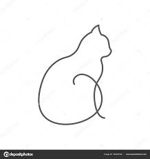
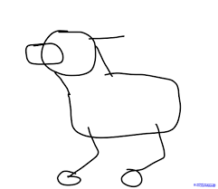
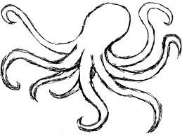

  
  
  

I started learning during October 2019 and started making projects implementing the same in Python. This project learns from previously stored sketchs. It can draw cats, dogs, octupuses, etc. 

You can learn more at the [Sketch RNN](https://github.com/dnabanita7/DeepLearningProject/blob/master/Sketch_RNN.py).
