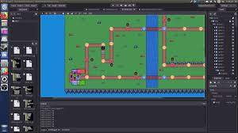

An animal crossing inspired game designed to replicate office environments to encourage socialization between coworkers.

Fellow Crossing is implemented using Godot engine. Within one week, we created an recreational office platform for Major League Hacking, GitHub. I worked on wrapping the project using SQLite wrapper and write up a script for using pre-stored database for the office based characters. I had never worked on game-dev or with godot engine before. It was a bit intimidating at the beginning but my team is amazing and we pulled it off.

In this project I gained experience with game development, godot engine and associated technologies, including Google Cloud Platform and My SQL for database storage.
 
You can know more about the project over [here](https://github.com/stellaw1/fellow-crossing) and the [inspiration](https://devpost.com/software/fellow-crossing) behind it.
